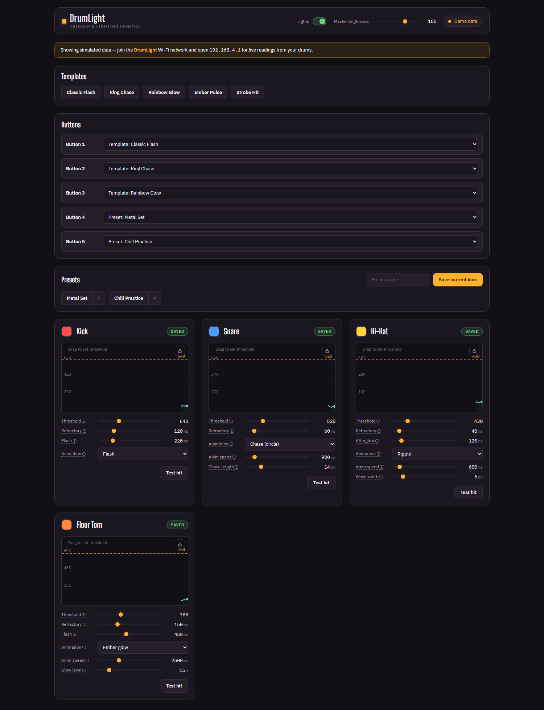
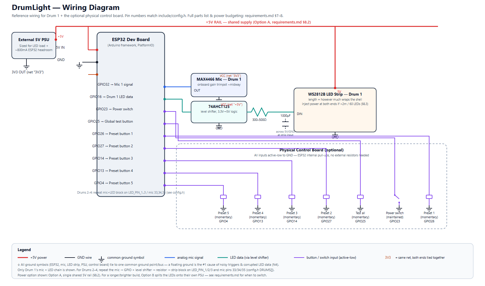

# DrumLight

Strike a drum, its LED strip flashes. ESP32 + MAX4466 mic(s) for hit detection,
WS2812B addressable LED strip(s) for the flash, and a phone-friendly web control
panel hosted by the ESP32 itself (its own WiFi network — no router or app needed).
Built to start with one drum and scale to a few more on the same ESP32.

See [requirements.md](requirements.md) for the full design (architecture, wiring/power
plan, BOM, and why the drum count tops out at 4 on one board).

*The web control panel in its built-in offline demo mode (opens automatically when there's no device to connect to) — the real thing looks the same, driven by live data.*

## Features

- Per-drum mic-based hit detection (envelope follower + threshold + refractory period).
- 11 LED animation modes per drum — flash, chase (single/double/persist), rainbow,
  color-cycle, ember, sparkle, ripple, strobe — see [include/config.h](include/config.h)
  for what each one does.
- Web control panel served by the ESP32 (connect to its WiFi AP, no internet/app
  required): live per-drum tuning of color/threshold/timing/animation, a real-time
  envelope graph for threshold tuning, master brightness, and a "test hit" button per
  drum.
- Presets: 5 built-in look templates plus up to 8 user-saved presets, each capturing
  every drum's color + animation in one snapshot.
- Optional physical control board: a maintained power switch, a "test all drums"
  button, and up to 5 momentary buttons that instantly recall a template/preset —
  reassignable live from the web UI, no reflash needed.
- All tunable settings (per-drum color/threshold/refractory/flash/animation, master
  brightness, lights on/off, preset-button mapping, saved presets) persist to flash
  (NVS), so they survive a power cycle.

## Build & flash

1. Install the [PlatformIO extension](https://platformio.org/install/ide?install=vscode) for VS Code.
2. Open this folder in VS Code — PlatformIO will detect `platformio.ini` automatically.
3. Connect the ESP32 over USB.
4. PlatformIO toolbar: Build (checkmark), then Upload (arrow) to flash the firmware.
5. **Upload the web UI too:** PlatformIO sidebar → Project Tasks → `esp32dev` →
   Platform → **Upload Filesystem Image**. This flashes [data/index.html](data/index.html)
   to the ESP32's LittleFS filesystem — without this step the device boots and detects
   hits fine, but the control panel won't load. Re-run it whenever `data/index.html`
   changes.
6. Open the Serial Monitor at 115200 baud for debug output (it also prints the AP's
   IP on boot).

## Using it

1. On a phone/laptop, connect to the WiFi network `DrumLight` (password `drumlight` —
   see [Configuration](#configuration) to change this).
2. Open `http://192.168.4.1` (or `http://drumlight.local`) in a browser — most phones
   will auto-prompt this as a captive portal login page.
3. Tune each drum's color, strike sensitivity, flash timing, and animation live; use
   "Test hit" to preview without striking the drum. Changes apply immediately and are
   saved to flash when you commit them from the UI.
4. Save the current look as a preset, or load one of the built-in templates, from the
   Presets panel.

## Wiring

Reference wiring for one drum plus the optional physical control board, matching the
pins in `config.h`. Full parts list, power-supply sizing, and wiring-gauge guidance:
[requirements.md §7–8](requirements.md#7-hardware--bill-of-materials).

## Configuration

Compile-time setup lives in [include/config.h](include/config.h): number of drums,
pins, LED counts, animation defaults, the control-board button/switch pins, WiFi AP
name/password, and the LED power budget.

Add a second drum by bumping `NUM_DRUMS` (up to 4) and adding a row to `DRUMS[]` — no
other code changes needed. Per-drum color/threshold/refractory/flash/animation values
in `DRUMS[]` are only **first-boot defaults**; once the device has booted once, those
are tunable live from the web UI and persisted to NVS, so editing them in `config.h`
afterwards has no effect until NVS is wiped.

Start with the default `threshold` and watch the web UI's live envelope graph (or the
Serial Monitor) while tapping the drum; raise it if it triggers on ambient noise, lower
it if real hits are missed. The MAX4466's onboard gain trimpot is the other sensitivity
knob — start at roughly midway.

### Fake-triggering a hit for testing

No wiring needed — every drum has a "Test hit" button in the web UI, which fires the
exact same flash animation a real mic hit would.

For a physical option, wire a momentary push button between `GLOBAL_TEST_BUTTON_PIN`
(set in `config.h`, default `GPIO25`) and `GND` — the ESP32's internal pull-up handles
the rest, no resistor needed. Pressing it fires every configured drum at once, through
the same trigger path as a real hit. Set `GLOBAL_TEST_BUTTON_PIN` to `NO_PIN` to leave
it unwired.
